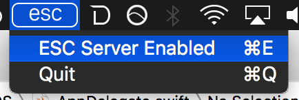
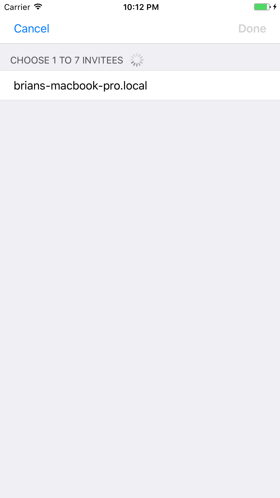
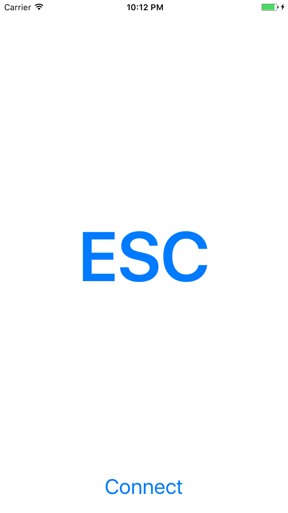

# ESCapey
An ESC key solution for new Apple Laptops

# Motivation
Welp, here's the problem. You use a cool text editor, and you _really_ need access to a hardware escape key. Then, all of a sudden, this comes along...

No physical key in sight. Maybe Apple will offer a dongle?! Now you need to purchase a bunch for home and work, that doesn't sound workable at all!

So what's the answer?

## Enter ESCapey
ESCapey is a macOS server and iOS client application pair that allow you to turn any iOS device into the escape key you've come to know and love!

## How Do I use ESCapey?

1. Turn on the ESC Server as indicated in the following screenshot.

2. Run the iOS client and connect to your machine by tapping the "Connect" button in the iOS interface.

3. Once connected, tap the "ESC" button to your hearts content!

# Known issues
This is garbage code that I wrote to amuse myself, don't depend on it, unless you'd really like to for whatever reason.
